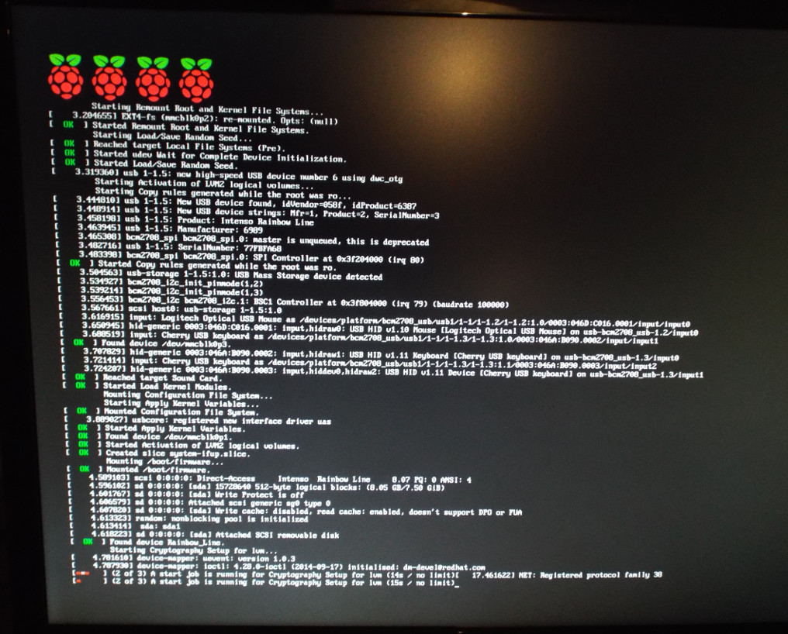

# rpi2bootstrap
Wrapper around debootstrap to install Debian for Rasberry Pi 2

# Introduction
This script creates a ready-to-boot Debian Jessie image
for a Raspberry Pi 2 (armv7).

# Features

* Creates Debian Jessie image ready to use for Raspberry Pi 2
* Uses original Raspberry Pi Linux Kernel from
  https://github.com/raspberrypi/linux in version 4.1.y
  with SELinux enabled
* Ready to use hardening scripts are installed during bootstrap
* Sizes of root partition and image can be provided
* Script to increase the encrypted filesystem to the SD disk
  included.
* Image contains three partitions: /, /boot/firmware and /enc
* /enc is an encrypted filesystem. The key must be stored
  on a USB stick that must be plugged in during boot.
* To get a graphical desktop, type *apt-get install task-xfce-desktop*
  and go for a coffee.

Does not work (at the moment):

* SELinux: does not work in enforcing mode.
  There are some AVCs that deny access to /etc/crypttab and
  some lvm_t things. Must be sorted out...

# Usage

    Usage: create_debian_rpi_img --working-dir working_dir --distribution distribution --variant variant
                                 --size image_size --enc-disk-id enc_disk_id --features feature_list
                                 [--packages pkglist] [--proxy proxy] [-sh-chroot chroot_sh]
    where
      working_dir  is the place where the image is build
                   Some gigs of HD space should be available there.
      distribution one of debian or ubuntu
      variant      the version, like jessie, stretch or wily
      image_size   the initial image size, e.g. '1G'
      enc_disk_id  disk id of the USB stick where the decryption key is stored
      pkglist      [optional] comma separated list of additional packages
      proxy        [optional] when there is the need to set the http(s)_proxy
                   set this to the appropriate url
      chroot_sh    [optional] Script that is executed in chroot
      feature_list [optional] Coma seperated list of additional features.
                   Existing features are:
                   - selinux: switches on SELinux
                   - hardening-io: runs the os and ssh scripts from hardening.io
                   - disk-resize: adds a script to the image that resizes the LVM to the size of the disk.

# Example

Create a Debian Jessie in the tmp dir '/data/RP/tmp' with 2GByte disk size
some additional packages and use the given USB stick as the key device.

    create_debian_rpi2_img.sh --working-dir /data/RP/tmp \
        --distribution debian --variant jessie --size 2G \
	--packages vim,less,iputils-ping,openssh-client,openssh-server,ntp \
	--enc-disk-id usb-My_USB_STICK_AABBCC-0:0 \
	--proxy http://10.0.0.1:3128/ \
	--features selinux,hardening-io

# Result
The booting Raspberry Pi 2 with the four PIs.

As you can see, decrypting the partition takes some seconds.

# Dependencies

The following (Debian) packages are needed to run the script:

* *parted*
  For creating partitions of the disk image
* *mount (losetup)*
  For mounting the image partitions in the existing system
* *kpartx*
  For handling the partitions in the image
* *dmeventd / dmsetup*
  For device mapping
* *cryptsetup-bin*
  Handling encryption of the third patition
* *lvm2*
  The encrypted partition contains LVM volume(s).
* *debootstrap*
  For bootstraping the system
* *qemu-user-static*
  For cross-installation: the script can be executed on any
  platform - not only on arm.
